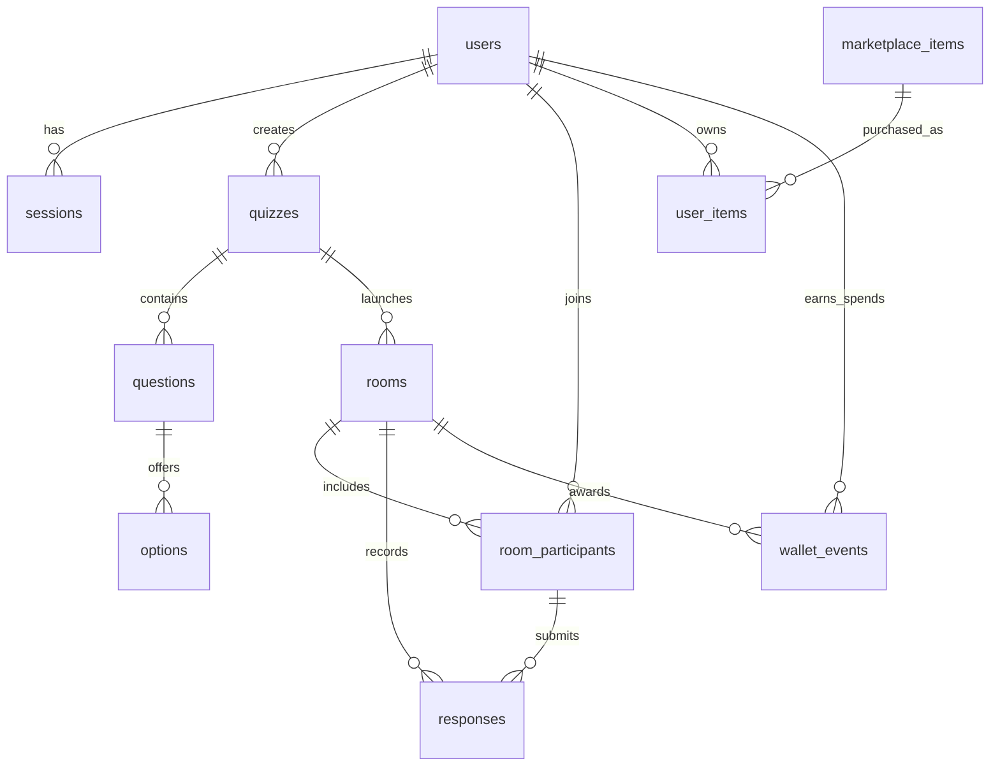

# QuizFlow MVP

QuizFlow is a real-time quiz platform prototype for organizers and participants. It includes quiz creation, live rooms, timed questions, WebSocket synchronization, scoring, reports, public quiz discovery, and a victory-points marketplace for player flair.

## Links

- Figma design: https://www.figma.com/design/Iir67uZiOFG9fOjQ5tzS4y/Untitled?node-id=0-1&p=f&t=gj5FxMSEWYS14AJv-0
- GitHub repository: https://github.com/khnychenkoav/quizflow-mvp

## Features

- User registration and sign-in for participants and organizers
- Organizer quiz builder with categories, timing, status, rules, text questions, image questions, single choice, and multiple choice
- Public platform pages: Explore, Library, Reports, Marketplace
- Public library of published quizzes
- Live room creation with a six-digit room code
- Real-time question broadcast with Socket.IO
- Answer submission only while the question is active
- Scoring with speed bonus
- Leaderboard for every room
- Reports for hosted and played quiz sessions
- Victory-points economy: 1st place earns 3 VP, 2nd earns 2 VP, 3rd earns 1 VP
- Marketplace items: name emoji badges and live room reactions
- Equipped emoji badges displayed in room leaderboards
- Personal profile with participation and hosted-room history

## Tech Stack

- Frontend: React 19, Vite, CSS, lucide-react
- Backend: Node.js, Express, Socket.IO
- Database: SQLite through Node 24 `node:sqlite`
- Auth: token sessions stored in SQLite
- Tests: Node test runner

## Quick Start

```bash
npm install
npm run build
npm start
```

Open:

```text
http://localhost:3001
```

Development mode:

```bash
npm run dev
```

Client:

```text
http://localhost:5173
```

Server:

```text
http://localhost:3001
```

## Test Accounts

Organizer:

```text
organizer@quizflow.test
demo12345
```

Participant:

```text
player@quizflow.test
demo12345
```

Marketplace test account with a large VP balance:

```text
rich@quizflow.test
rich12345
```

## Main Workflows

Organizer flow:

1. Sign in as an organizer.
2. Open Pro Mode.
3. Create or edit a quiz in My Quizzes.
4. Start a room.
5. Share the room code.
6. Launch questions one by one.
7. Finish the quiz and review the leaderboard.

Participant flow:

1. Sign in or join by display name.
2. Enter the room code.
3. Answer only while each question is active.
4. View the leaderboard.
5. Earn VP for podium finishes.
6. Buy emoji badges or reactions in Marketplace.

## Database Model

SQLite database path:

```text
data/quizflow.sqlite
```

Core tables:

- `users`: account data, role, password hash, VP wallet
- `sessions`: auth tokens
- `quizzes`: quiz metadata, category, rules, status
- `questions`: prompt, media type, answer mode, timer, points
- `options`: answer options and correctness
- `rooms`: live room state, code, current question, timing
- `room_participants`: room users and scores
- `responses`: submitted answers, correctness, earned points
- `marketplace_items`: emoji badges and reactions
- `user_items`: purchased and equipped items
- `wallet_events`: VP awards and purchases



## Project Structure

```text
server/db.js          SQLite schema, seed data, quiz helpers, reports, marketplace
server/index.js       Express API, auth routes, room routes, Socket.IO events
src/main.jsx          React application and screens
src/styles.css        Dark QuizFlow visual system inspired by the Figma design
public/               Static visual assets
tests/                Node tests
```

## Scripts

```bash
npm run dev
npm run build
npm start
npm test
```

## Notes

The MVP uses Node 24 `node:sqlite`, which is currently marked experimental by Node.js. The app works locally, but a production version should move to a stable database driver or a managed database such as PostgreSQL.
